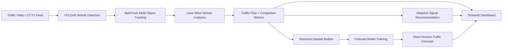

# Intelligent Traffic Management System Using AI and CV

An end-to-end traffic intelligence web application that analyzes roadway video with computer vision, estimates lane-level congestion, recommends adaptive signal timing, stores historical traffic behavior, and generates short-horizon traffic forecasts.

This project is designed as a strong portfolio piece for AI, computer vision, and smart-city systems work. It combines detection, tracking, analytics, forecasting, and a polished Streamlit interface in one deployable repository.

## Why This Project Matters

Traditional traffic lights often rely on fixed timers even when one lane is heavily congested and another is almost empty. This system is built around a smarter workflow:

- monitor traffic from CCTV or uploaded intersection footage
- detect and track vehicles in each lane
- estimate congestion in real time
- recommend adaptive signal timing
- store historical traffic behavior for future learning
- forecast near-future traffic load
- prepare the architecture for emergency-vehicle priority logic

## Current Status

This repository is already a serious prototype, not a concept demo.

Implemented now:

- Streamlit web application with upload-and-analyze workflow
- YOLOv8 vehicle detection
- ByteTrack vehicle tracking
- line-cross traffic counting
- lane-wise congestion estimation
- adaptive signal timing recommendation
- annotated video generation
- persistent historical traffic storage
- training-ready forecasting dataset
- first baseline learned forecasting model

Planned next:

- live RTSP / CCTV stream ingestion
- fine-tuned emergency vehicle classifier
- stronger forecasting model with more diverse data
- integration with traffic-control APIs or hardware

## System Architecture



## Core Features

- Vehicle detection for cars, buses, trucks, and motorcycles
- Persistent multi-object tracking with IDs
- Lane-aware congestion estimation
- Adaptive green-light recommendation logic
- Historical multi-run data storage
- Forecast-training dataset generation
- Learned baseline forecasting model
- Interactive dashboard with charts, metrics, and annotated footage preview

## Repository Layout

- `dashboard.py`: main Streamlit web app
- `traffic_pipeline.py`: reusable detection and analytics pipeline
- `main.py`: CLI entry point for single-run analysis
- `batch_collect.py`: batch-ingest videos into the training dataset
- `forecast_model.py`: learned forecasting model utilities
- `train_forecast_model.py`: forecast model trainer
- `dataset_manifest.csv`: manual batch-ingest template
- `dataset_manifest_auto.csv`: auto-generated manifest for local collection
- `videos/traffic.mp4`: bundled sample video
- `models/`: trained forecasting model bundles
- `history/`: historical traffic logs and supervised forecasting data

## Quick Start

### 1. Create a Virtual Environment

```powershell
python -m venv .venv
.\.venv\Scripts\Activate.ps1
pip install -r requirements.txt
```

### 2. Launch the Web App

```powershell
streamlit run dashboard.py
```

### 3. Run the Analyzer from the CLI

```powershell
python main.py --video videos/traffic.mp4
```

## Local Workflow

### Analyze a Single Video

```powershell
python main.py --video videos/traffic.mp4 --output-csv outputs/run.csv --output-video outputs/run.mp4
```

### Batch-Collect Training Data

```powershell
python batch_collect.py --manifest dataset_manifest.csv --skip-video-output
```

### Train the Forecasting Model

```powershell
python train_forecast_model.py
```

After training, the dashboard automatically loads `models/traffic_forecast_model.json` and uses the learned model for forecasting. If the model file is missing, the app falls back to a heuristic forecast.

## Deployment

This repo is now set up for practical deployment in a few ways.

### Streamlit Cloud

Use `dashboard.py` as the app entry point and install from `requirements.txt`.

### Docker

Build and run locally:

```powershell
docker build -t traffic-ai .
docker run -p 8501:8501 traffic-ai
```

### Render

A basic `render.yaml` is included for Docker-based deployment.

## Testing And CI

Run tests locally:

```powershell
pip install -r requirements-dev.txt
pytest
```

Included now:

- forecasting helper tests
- history-writing helper tests
- GitHub Actions CI workflow for pushes and pull requests

## Forecasting Data Pipeline

Each analysis run appends data into:

- `history/traffic_history.csv`: raw multi-run traffic observations
- `history/forecast_training_data.csv`: supervised rows for forecasting experiments

The training dataset includes:

- current vehicles per minute
- current unique vehicles
- lane-wise vehicle counts
- lane-wise congestion features
- capture context such as time of day and weather
- next-step vehicles per minute target
- next-step traffic-status target

## Data Collection Guidance

For a stronger forecasting model, collect videos across:

- morning, afternoon, evening, and night
- weekdays and weekends
- clear and rainy weather
- different intersections and camera angles
- low, medium, and high congestion periods

The current baseline model works, but it becomes meaningful only when trained on a larger and more diverse dataset.

## Emergency Vehicle Detection Status

The emergency-priority workflow is already supported in the project architecture, but the default `yolov8n.pt` model does not include ambulance, fire-truck, or police-vehicle classes. A fine-tuned emergency-aware model is required to activate real emergency detection.

## Deployability Notes

This repository is meant to be GitHub-showcase ready:

- clean startup instructions
- Docker support
- Streamlit config
- CI workflow
- tests
- structured data collection flow
- production-friendly documentation

For a true production deployment, the next engineering upgrades would be:

- background job processing for long videos
- cloud object storage for uploads and outputs
- database-backed run history
- authentication and role-based access
- real RTSP stream processing
- hardware or API integration for signal control

## Tech Stack

- Python
- Streamlit
- OpenCV
- Ultralytics YOLOv8
- Supervision / ByteTrack
- Pandas
- NumPy
- Altair

## Showcase Summary

If you want one sentence for GitHub or LinkedIn:

> Intelligent Traffic Management System Using AI and CV is a deployable smart-traffic analytics application that uses computer vision to detect vehicles, estimate lane congestion, recommend adaptive signal timing, and forecast short-horizon traffic behavior from historical video data.
